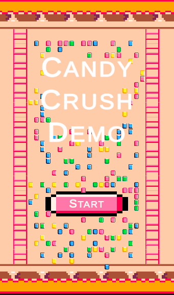

# Candy Crush Demo
A clone of Candy Crush Saga mobile game. Different from the original game, this game is an endless game.

# Gameplay
User clicks on two tiles to swap their places on the grid. If there are any matches, these tiles are removed from the grid. Minimum match size is 3, and maximum match size set to be 5. User receives 10 score for each tile removed from the grid. Each tile is spawned using RNG.

There are 4 powerups: color remover, bomb, column remover and row remover. When a tile is switched with color remover, each tile with that color (including powerup ones) are destroyed. Bomb, column remover and row remover powerups are activated upon any match within its color. In order to create color remover, user must make a match with 5 tiles. Matches with 4 tiles create row/column remover and "L" shaped matches are creating bombs.

## Game Screen

# Implemented Features
* A grid class that controls everything about tiles.
* Tiles have swap, drop and destrop animations.
* Animations are created using code.
  * Animation update code is supporting translation, rotation and changing scale.
* Controllable game environment using game config.
  * Grid shape can be changed.
  * Up to 8 colors of tiles are supported.
  * Some powerup specifications can be set using game config.
  * Animation delays are parametrized.
  * Minimum/maximum sequence lengths for faster pattern-matching can be set.
* Debug mode.
  * A history class that saves grid color history to check if everything works correctly.
  * Navigation in history is done by arrow keys.
  * Random powerup generation for debugging.

# Current Bugs
* Color removers may remove other color removers without interaction
* Color removers may cause inappropriate tile swap
